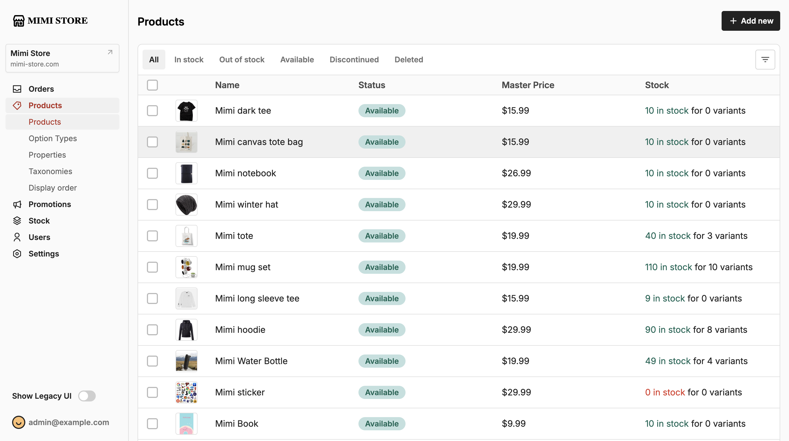

<p align="center">
  <a href="https://github.com/lpthong90/rails-mimi-store">
    
  </a>
  <br>
  <em>Using Ruby on Rails to demo a e-commerce application.</em>
</p>
<!--more-->

---

**Documentation**: <a href="https://lpthong90.dev/rails-mimi-store" target="_blank">https://lpthong90.dev/rails-mimi-store</a>

**Source Code**: <a href="https://github.com/lpthong90/rails-mimi-store" target="_blank">https://github.com/lpthong90/rails-mimi-store</a>

---

<!-- # Features -->

# Run

```bash
> bundle install
> ./bin/dev
```

# Snapshots

Home


Clothing


Accessories


Admin Orders


Admin Products


Admin Product Detail


<!-- # Video demo: -->
